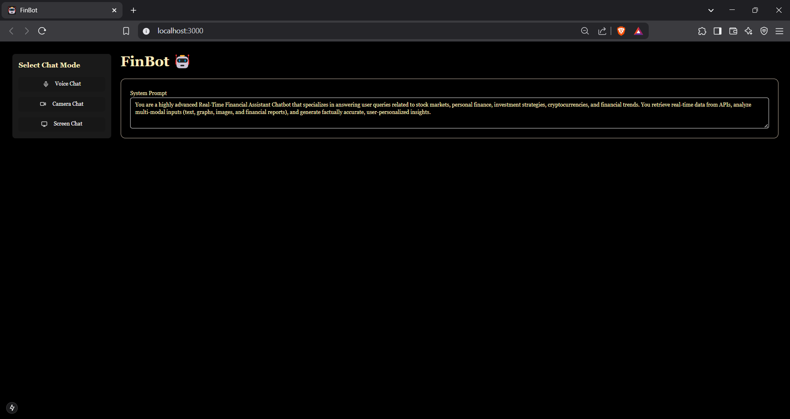

## FinBOT_live🤖

## Overview

**FinBOT** is a **Real-Time Financial Assistant Chatbot** engineered to deliver expert-level insights on stock markets, personal finance, investment strategies, cryptocurrencies, and financial trends. It processes real-time data and supports multi-modal inputs (audio, video, text). The system utilizes **WebSockets, MediaStream, and Web Audio API**, built on a **FastAPI backend** and a **Next.js frontend** with TypeScript.

### Tech Stack
- **Backend**: FastAPI server orchestrating WebSocket connections and Gemini API interactions.
- **Frontend**: Next.js application facilitating multi-modal user engagement.

---

## preview


## Directory Structure
```
bhaswanth67-finbot_live/
├── Readme.md
├── backend/
│   ├── main.py
│   └── requirements.txt
└── frontend/
    ├── components.json
    ├── eslint.config.mjs
    ├── next.config.ts
    ├── package-lock.json
    ├── package.json
    ├── postcss.config.mjs
    ├── tailwind.config.ts
    ├── tsconfig.json
    ├── .gitignore
    ├── app/
    │   ├── globals.css
    │   ├── layout.tsx
    │   └── page.tsx
    ├── components/
    │   ├── gemini-playground.tsx
    │   └── ui/
    │       ├── alert.tsx
    │       ├── button.tsx
    │       ├── card.tsx
    │       ├── checkbox.tsx
    │       ├── label.tsx
    │       ├── select.tsx
    │       └── textarea.tsx
    └── lib/
        └── utils.ts
```

- **backend/**: Server logic and dependencies.
- **frontend/**: Client-side codebase, UI components, and configurations.

---

## Backend

### `main.py`

A **FastAPI** implementation handling real-time WebSocket communication with the Gemini API.

#### Features:
- **WebSocket Endpoint**: `/ws/{client_id}` for client-specific connections.
- **GeminiConnection**: Manages Gemini API interactions for audio, image, and text inputs.
- **CORS Middleware**: Facilitates cross-origin requests.
- **Environment Variables**: Loads `GEMINI_API_KEY` via `python-dotenv`.

#### Operations:
- Accepts client configuration (system prompt, voice settings).
- Processes PCM audio, JPEG images, and text, relays them to the Gemini API.
- Returns audio/text responses via WebSocket.

#### Execution:
```bash
uvicorn main:app --host 0.0.0.0 --port 7523
```

#### Dependencies (`requirements.txt`):
```text
fastapi
uvicorn
python-dotenv
websockets
pyaudio
google-genai
```

---

## Frontend

### `gemini-playground.tsx`
A React component in `components/` enabling **Voice Chat**, **Camera Chat**, and **Screen Chat** modes.

#### Features:
- **Modes**: Audio, video, screen sharing.
- **WebSocket**: Connects to `ws://localhost:7523/ws/${clientId}`.
- **Audio Processing**: Captures microphone input, converts to PCM16, sends as base64.
- **Video Processing**: Streams camera/screen frames as base64 JPEGs every second.
- **UI**: Tailwind CSS and `ui/` components.

#### State:
- `isStreaming`: Stream status.
- `chatMode`: `audio` or `video`.
- `videoSource`: Camera or screen.

#### Processing:
- **Audio**: Web Audio API at 16kHz, Float32 to PCM16 via `float32ToPcm16`.
- **Video**: `getUserMedia` / `getDisplayMedia`, canvas frame capture.

### `app/`
- **layout.tsx**: Root layout, metadata (`title: "FinBot"`), global styles.
- **page.tsx**: Renders `GeminiPlayground`.
- **globals.css**: Tailwind CSS setup, custom theme variables.

### `components/ui/`
- Radix UI-enhanced, Tailwind-styled components:
  - `alert.tsx`, `button.tsx`, `card.tsx`, `checkbox.tsx`, `label.tsx`, `select.tsx`, `textarea.tsx`.

### `lib/utils.ts`
- `cn`: Class name utility.
- `float32ToPcm16`: Float32 to PCM16 conversion.
- `base64ToFloat32Array`: Base64 to Float32 decoding.

### Configurations
- **`next.config.ts`**: Next.js settings.
- **`tsconfig.json`**: TypeScript config, path aliases (`@/* → ./*`).
- **`tailwind.config.ts`**: Tailwind customization.
- **`package.json`**: Dependencies (Next.js 15.1.0, React 19.0.0), scripts (`dev`, `build`, `start`, `lint`).

---

## Functionality

### **Interaction Flow**
1. **User selects a mode** → WebSocket connects.
2. **Data Capture**:
   - **Audio**: PCM16, base64-encoded.
   - **Video**: JPEG, base64-encoded.
3. **Processing**:
   - Backend relays to Gemini API, retrieves response.
4. **Delivery**:
   - Frontend plays audio or displays text.

### **Example: Voice Chat**
#### **Scenario**
User queries stock market trends via voice.

#### **Flow**
##### **Initiation**:
User clicks "Voice Chat", WebSocket connects, config sent:
```json
{
  "type": "config",
  "config": {
    "systemPrompt": "You are a highly advanced Real-Time Financial Assistant Chatbot...",
    "voice": "Puck",
    "allowInterruptions": false
  }
}
```

##### **Query**:
User says: "What are the current stock market trends?"
Audio to PCM16, base64-encoded:
```json
{
  "type": "audio",
  "data": "<base64-encoded PCM16>"
}
```

##### **Processing**:
Backend forwards to Gemini API, receives an audio response.

##### **Response**:
Backend sends:
```json
{
  "type": "audio",
  "data": "<base64-encoded audio>"
}
```
Frontend decodes, plays: "The stock market is currently experiencing a bullish trend..."

##### **UI**:
- **Streaming Status**: "Listening..." with microphone icon.
- **Response Display**:
```text
The stock market is currently experiencing a bullish trend due to strong earnings reports.
```

---

## Conclusion

FinBOT integrates real-time multi-modal processing with AI-driven financial insights, featuring a **modular FastAPI-Next.js architecture**, **WebSockets**, and **TypeScript** for scalability and robustness.

